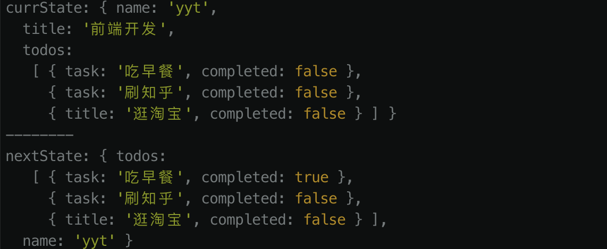
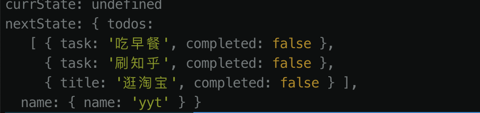
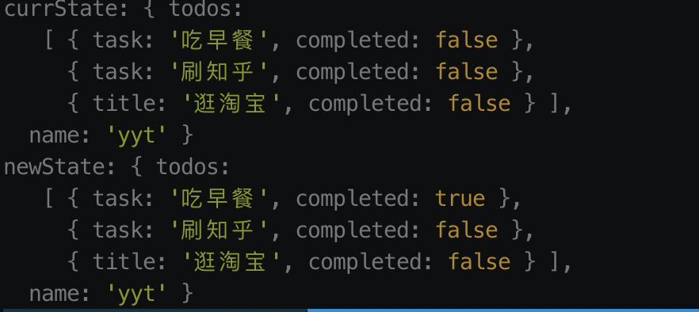
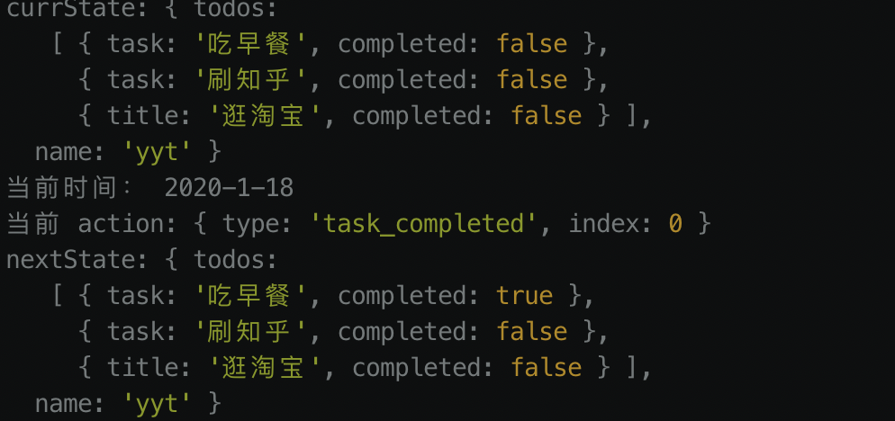
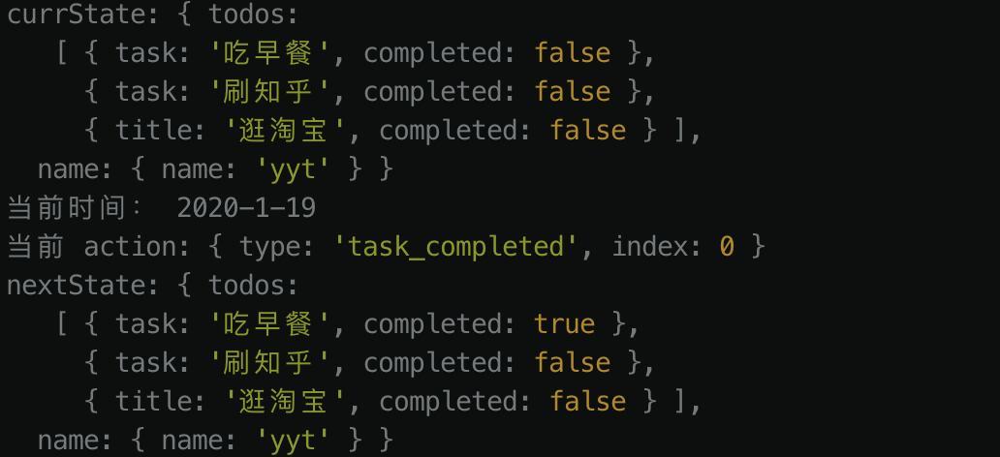

## redux 从零实现一个 redux

### 写在前面

`redux`是什么以及能干什么，请参考[Redux](https://www.redux.org.cn/docs/introduction/Motivation.html)，在我看来`redux`的核心思想就是`通过强约束性的方式里管理共享状态`

### 开始

本文将会根据`redux`中经常使用到的`api`进行实现：

`store`、 `action`、`dispatch`、`reducer`

使用过的同学肯定对上面这几个`api`都很熟悉，他们实现了`redux`最基本的功能：

- `store`: `redux` 应用只有一个单一的 `store`，一般来说存放的是项目中需要`共享的数据`。

- `action`: 把数据从应用传到 `store` 的有效载荷，它是`store` 数据的唯一来源，一般来说你会通过 `store.dispatch()` 将 `action` 传到 `store`，通常`action`是一个对象，并携带有一个`type`字段。

- `dispatch`: 分发 `action`，这是触发 `state` 变化的惟一途径。

- `reducer`: 根据`action`携带的载荷，更新`store`，`纯函数`。

### store

首先定义一个`store`，存放我们项目中需要`共享的数据`。

```js
const state = {
  name: 'yyt',
  title: '前端开发',
  todos: [
    {
      task: '吃早餐',
      completed: false,
    },
    {
      task: '刷知乎',
      completed: false,
    },
    {
      title: '逛淘宝',
      completed: false,
    },
  ],
};
```

### action

看了看表，已经 `11` 点，理论上是应该吃过早餐了，现在我们把`吃早餐`这个`todo`的状态改成完成，因此我们定义以下`action`:

```js
{
  type: 'task_completed',
  index: 0, // 通过 `index` 去匹配吃早餐这个todo
}
```

### reducer

通过`reducer`，对`state`进行更新

```js
function todosReducer(state, action) {
  const { type } = action;
  switch (type) {
    case 'task_completed':
      return state.map((todo, index) => {
        if (index === action.index) {
          return {
            ...todo,
            completed: true,
          };
        }
        return todo;
      });
    default:
      return state;
  }
}
```

### dispatch

按照约定我们需要通过`dispatch`去分发一个`action`，进行状态的更改。

```js
function dispatch(action) {
  todosReducer(state.todos, action);
  console.log('现在的state:', state);
}

dispatch({
  type: 'task_completed',
  index: 0, // 通过 `index` 去匹配吃早餐这个todo
});
```

把以上代码放到浏览器控制台，执行之后不出意外，应该可以看到以下数据

```js
现在的store: {
  name: 'yyt',
  title: '前端开发',
  todos: [
    {
      task: '吃早餐',
      completed: true, //这里已经状态更改成功
    },
    {
      task: '刷知乎',
      completed: false,
    },
    {
      title: '逛淘宝',
      completed: false,
    },
  ]
}
```

以上就是`redux`的最基本的数据流，但都是硬编码的方式实现的，不像一个可以让人使用的工具，下面我们让它变得更像一个工具一些, 并增加一个`订阅函数`用于状态改变之后向外部广播通知

```js
function createStore(reducer, initialState) {
  let currState = initialState;
  const listeners = [];

  function dispatch(action) {
    currState = reducer(currState, action);
    // 通知监听对象
    for (let i = 0, len = listeners.length; i < len; i++) {
      listeners[i]();
    }
  }

  function subscribe(listener) {
    listeners.push(listener);
    // 返回一个解除对应监听的函数
    return function unsubscribe() {
      const index = listeners.indexOf(listener);
      listeners.splice(index, 1);
    };
  }

  function getStore() {
    return currState;
  }

  return {
    subscribe,
    getStore,
    dispatch,
  };
}
```

现在让我们执行以下代码（可以把代码粘贴到浏览器控制台运行）

```js
const store = createStore(todosReducer, state);

store.subscribe(() => {
  console.log(store.getStore());
});

store.dispatch({
  type: 'task_completed',
  index: 0, // 通过 `index` 去匹配吃早餐这个todo
});
```

不出意外的话，上面的代码执行或抛出错误`Uncaught TypeError: state.map is not a function`，为什么呢？
可以看到我们在执行`createStore`的时候传入的是`state`，然而我们在执行`dispatch`的时候，是对`state.todo`进行更改，而我们的`todosReducer`中传入的是`state`，因此`state.map`就报错了，最简单的修复办法就是把`todosReducer`传入的`state`改成`state.todos`，但是这样做的做法耦合性太强，我们继续改造我们的代码，使它变得更加的适用

```js
function combineReducers(reducers) {
  return function(state = {}, action = {}) {
    const nextState = {};
    Object.keys(reducers).reduce((prev, curr) => {
      nextState[curr] = reducers[curr](state[curr], action);
    }, '');
    return nextState;
  };
}
```

随着我们的业务复杂度的增加，`reducer`肯定不止一个(当然你非要写在一个里面也问题，但是这样做不利于维护)，因此我们需要提供这样一种方式，可以让使用者自由拆分`reducer`，然后通过`combineReducers`帮使用者组合。

```js
// 增加一个更改 name 的 reducer
function nameReducer(state, action) {
  const { type, name } = action;
  switch (type) {
    case 'changename':
      return { ...state, name };
    default:
      return state;
  }
}
```

合并后的 `reducer` 可以调用各个子 `reducer`，并把它们返回的结果合并成一个 `state` 对象。 由 `combineReducers()` 返回的 `state` 对象，会将传入的每个 `reducer` 返回的 `state` 按其传递给 `combineReducers()` 时对应的 `key` 进行命名。

我们再次运行代码

```js
const store = createStore({ todosReducers, nameReducers }, state);

store.subscribe(() => {
  console.log(store.getStore());
});

// 更改 todo
store.dispatch({
  type: 'task_completed',
  index: 0, // 通过 `index` 去匹配吃早餐这个todo
});

// 更改 name
store.dispatch({
  type: 'changename',
  name: 'xyy',
});
```

查看执行结果



从上图可以看到，数据已经更改了，但是还有一个重要的信息，`title`这个字段在更新数据的过程被删掉了，回过头看一下`combineReducers`函数，就不难理解为什么发生这样的情况，`combineReducers`中返回的`nextState`只包含了跟传入的`reducers`对应的数据，我们没有传入针对`title`的`reducer`，因此也就没有发返回了，这个从`redux`的官方文档中也能看出来：

[返回值：(Function)：一个调用 reducers 对象里所有 reducer 的 reducer，并且构造一个与 reducers 对象结构相同的 state 对象。](https://www.redux.org.cn/docs/api/combineReducers.html)

解决这个问题可以在`dispatch`函数中，对`state`做一个合并，像这样

```js
function dispatch(action) {
  console.log('currState:', currState);
  // currState = reducer(currState, action); 这里更改一下
  currState = Object.assign(initialState, reducer(currState, action));
  // 通知监听对象
  for (let i = 0, len = listeners.length; i < len; i++) {
    listeners[i]();
  }
}
```

然后再运行刚才的代码，更改前后数据丢失的问题就不存在了，但是我们可以思考一下，使用`redux`的初衷是什么？我想一般都是因为`项目过于庞大`，想把`共享的数据`维护到一个地方，便于`统一管理`，如果一个数据是不要对它进行更改的话，意味着它是一个常量，并没有共享的意思，在这种个情况下，还把它放在`state`显的不是那么合适，因此像上面的情况，正常情况下是不应该出现的。

上面我们允许使用者对`reducer`做了拆分，那也意味着同样可以对`state`进行拆分，像这样：

首先更改一下`createStore`

```js
function createStore(reducer, initialState) {
  ...
  // 新增下面这段代码
  dispatch({type: 'INIT'});
  ...
}
```

然后更改已改一下我们前面定义好的`reducer`，依`todosReducer`为例，`nameReducer`下同

```js
const todos = [
  {
    task: '吃早餐',
    completed: false,
  },
  {
    task: '刷知乎',
    completed: false,
  },
  {
    title: '逛淘宝',
    completed: false,
  },
];

function todosReducer(state = todos, action) {
  const { type } = action;
  switch (type) {
    case 'task_completed':
      return state.map((todo, index) => {
        if (index === action.index) {
          return {
            ...todo,
            completed: true,
          };
        }
        return todo;
      });
    default:
      return state;
  }
}
```

也就是给对应的`reducer`加上对应的默认参数，最后执行

```js
createStore(combineReducers({ todos: todosReducer, name: nameReducer }));
```

查看打印结果



可以看到`state`已经按照我们传入的默认值初始化了，如果我们在调用`createStore`传入了参数的话，那打印出来的结果就是手动传入的参数了，不信的话，可以动手试一试 🤣

其实进行到这一步的时候，笔者遇到了不少的错误，在排错的过程中，也在代码中使用了`log`来定位问题，就像上面的图示一样，可以看到`currState`和`nextState`这 2 个`log`，这 2 句`log`是硬编码进`dispatch`，任何时候使用都会打印出这 2 句`log`， 编程过程中`log`是有必要的，比如`记录日志`，但是每个人对`log`的需求确实不一样的，为了友好，我们提供一种让使用者可以自由添加`log`的功能，用`redux`的话来说，就是`middleware`

### middleware

`middleware`只是包装了`store`的`dispatch`方法，对`disaptch`进行扩展，执行以下代码

```js
const store = createStore(
  combineReducers({ todos: todosReducer, name: nameReducer }),
  state,
);

const next = store.dispatch;
// 这里就可以看成是一个`middleware`
store.dispatch = action => {
  console.log('currState:', store.getStore());
  next(action);
  console.log('newState:', store.getStore());
};
store.dispatch({
  type: 'task_completed',
  index: 0, // 通过 `index` 去匹配吃早餐这个todo
});
```

查看执行结果，预期正确



不难发现这种方式，这种方式使用起来存在以下问题

- 需要使用者手动在`redux`外部对`dispatch`进行扩展
- 如果要添加更多的`middleware`，通过以上的方式添加，导致`dispatch`过大
- `middleware`无法独立出去

下面我们试图实现一种方式，并解决以上问题，

### applyMiddleware

首先定义 2 个`middleware`

```js
const logMiddleware1 = store => next => action => {
  console.log('currState:', store.getStore());
  next(action);
  console.log('nextState:', store.getStore());
};

const logMiddleware2 = store => next => action => {
  console.log('当前时间：', new Date().toLocaleDateString());
  console.log('当前 action:', action);
  next(action);
};
```

`middleware`中，把`store`和`dispatch`，全部通过参数的方式传进去，就实现了`middleware`的独立

实现`applyMiddleware`函数

```js
function applyMiddleware(store, ...middlewares) {
  // 保证最后一个 `dispatch` 是原始的 `dispatch`
  let next = store.dispatch;
  middlewares.reverse().map(middleware => {
    next = middleware(store)(next);
  });
  return next;
}
```

`applyMiddleware`允许我们将独立定义的`middleware`通过参数的形式传入，就解决了`dispatch`过大的问题

执行以下代码

```js
const store = createStore(
  combineReducers({ todos: todosReducer, name: nameReducer }),
  state,
);
store.dispatch = applyMiddleware(store, logMiddleware1, logMiddleware2);
store.dispatch({
  type: 'task_completed',
  index: 0, // 通过 `index` 去匹配吃早餐这个todo
});
```

执行结果完全正确



但是目前还是不能解决我们需要手动重写`store.dispatch`的问题，因此我们需要在`createStore`的内部对`dispatch`进行重写，下面开始改写`createStore`函数

首先改写`createStore`函数

```js
function createStore(reducer, initialState, enhancer) {
  // 如果传入的 initialState 是一个函数，且没有传入 enhancer, 将 initialState 赋值给 enhancer
  if (typeof initialState === 'function' && typeof enhancer === 'undefined') {
    enhancer = initialState;
    initialState = undefined;
  }
  if (typeof enhancer === 'function') {
    return enhancer(createStore)(reducer, initialState);
  }
  // 下面的不变
  ...
}
```
`createStore`增加了一个`enhancer`的函数，也就是之后要传进来的`applyMiddleware`，然后对参数做了一些判断

更改`applyMiddleware`函数

```js
function applyMiddleware(...middlewares) {
  return createStore => (state, initialState, enhancer) => {
    const newStore = createStore(state, initialState, enhancer);
    let next = newStore.dispatch;
    middlewares.reverse().map(middleware => {
      next = middleware(newStore)(next);
    });
    // 注意：这里不能再返回 `next` 了，这里应该返回了一个包含了扩展之后的`dispatch`的新的 `store` 实例
    // return next;
    return {
      ...newStore,
      dispatch: next,
    };
  };
}
```

执行代码

```js
const store = createStore(
  combineReducers({ todos: todosReducer, name: nameReducer }),
  applyMiddleware(logMiddleware1, logMiddleware2),
);

// 更改 todo
store.dispatch({
  type: 'task_completed',
  index: 0, // 通过 `index` 去匹配吃早餐这个todo
});
```


到这里我们已经基本实现了`redux`比较常用的`api`。

### 补充

### compose

看过官方的`redux`源码的话，可以看到在`applymiddleware`这里使用`compose`

```js

function compose(...chains) {
  const len = chains.length;
  if (len === 0) return;
  if (len === 1) return chains[0];
  return chains.reduce((a, b) => (...args) => a(b(...args)));
}

function applyMiddleware(...middlewares) {
  return createStore => (state, initialState, enhancer) => {
    const newStore = createStore(state, initialState, enhancer);
    let next = newStore.dispatch;
    // middlewares.reverse().map(middleware => {
    //   next = middleware(newStore)(next);
    // });
    // 注意：这里不能再返回 `next` 了，这里应该返回了一个包含了扩展之后的`dispatch`的新的 `store` 实例
    // return next;
    const { dispatch, getStore } = newStore;
    // 这里在中间件的执行过程中，只用到了`disptch`和`getStore`
    const middlewareApi = {
      dispatch,
      getStore,
    };
    const chains = middlewares.map(middleware => middleware(middlewareApi))
    next = compase(...chains)(next);
    return {
      ...newStore,
      dispatch: next,
    };
  };
}
```
可以看到 `compose`的其实就是使用`Array.reduce`的这个`api`来帮我们完成之前使用`middlewares.reverse().map`做的事情

[`点击查看reduce使用场景和实现原理`](https://juejin.im/post/5bb099c6e51d450e4f38e121)


### bindActionCreators

这个函数很少用到，惟一会使用到 `bindActionCreators` 的场景是当你需要把 `action creator` 往下传到一个组件上，却不想让这个组件觉察到 `redux` 的存在，而且不希望把 `dispatch` 或 `redux store` 传给它
`截止到目前为止，我还没有使用过这个api`，下面的内容完全摘抄[`redux`](https://github.com/reduxjs/redux/blob/master/src/bindActionCreators.ts)

```js
function bindActionCreators(actionCreators, dispatch) {
  if (typeof actionCreators === 'function')
    return bindActionCreators(actionCreators, dispatch);

  if (typeof actionCreators === 'object') {
    const boundActionCreators = {};

    Object.keys(actionCreators).map(ac => {
      typeof ac === 'function'
        ? (boundActionCreators[ac] = bindActionCreators[(ac, dispatch)])
        : '';
    });

    return boundActionCreators;
  }
}
```

